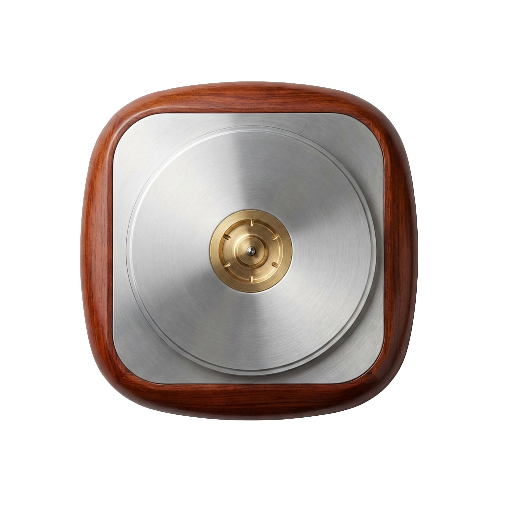

# 💿 D I S C F L O W

> *Spin your digital tunes on a virtual deck.*


---

**DiscFlow** brings the tactile soul of vinyl to your digital desktop. It's a floating widget that transforms your Spotify or Apple Music stream into a spinning record, complete with a moving tonearm and high-resolution cover art.

<p align="center">
  
</p>

## 📻 F E A T U R E S

*   **Analog Soul**: Realistic turntable physics with a tonearm that drops when the music starts.
*   **High-Fidelity**: Fetches high-resolution artwork for the *exact* song you're playing.
*   **Zero Friction**: Always-on-top, frameless design that floats over your work.
*   **Tactile Control**:
    *   **Scroll** to adjust volume.
    *   **Hover** to reveal playback controls.
    *   **Drag** to position anywhere.

## 💾 I N S T A L L A T I O N

1.  **Clone the frequency**:
    ```bash
    git clone https://github.com/vex-codes/DiscFlow.git
    cd DiscFlow
    ```

2.  **Tune the dependencies**:
    ```bash
    pip install -r requirements.txt
    ```

## 🕹️ U S A G E

Ignite the deck:

```bash
python3 main.py
```

*   **Play Music**: Start Spotify or Apple Music. The needle drops automatically.
*   **Controls**: Hover for Play/Pause/Skip.
*   **Volume**: Scroll up/down on the record.
*   **Quit**: Click the **✕** in the top-right corner.

## 📼 T E C H   S T A C K

*   **Core**: Python 3
*   **Visuals**: PySide6 (Qt) with `QPainter` rendering
*   **Audio Link**: AppleScript (OSA)

---

<p align="center">
  <i>Made with 🎧 by Vex Codes</i>
</p>
